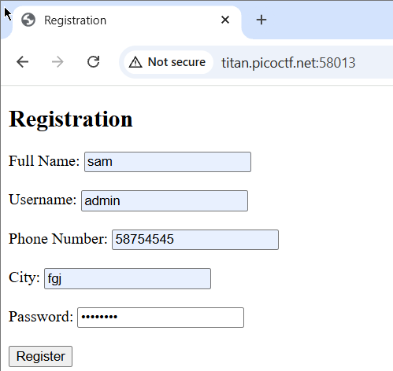
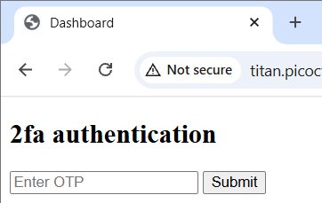
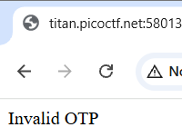
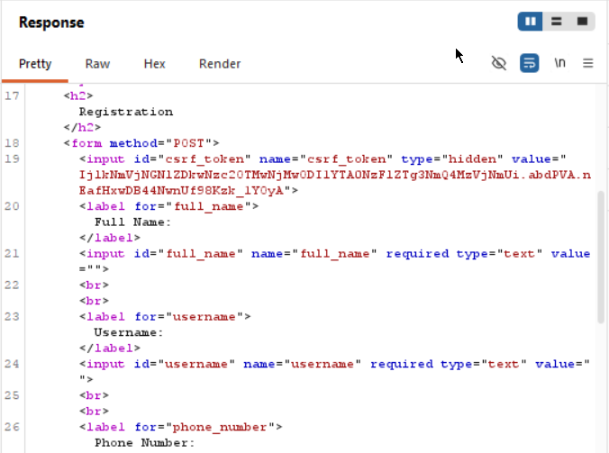
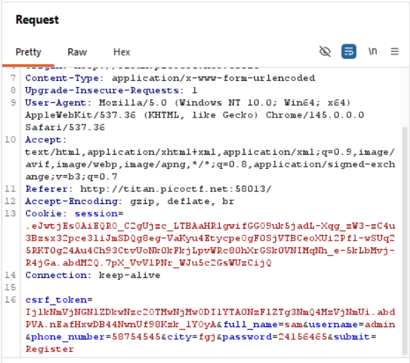
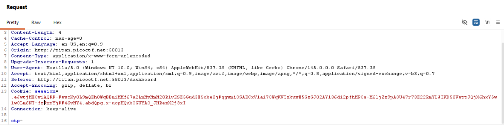
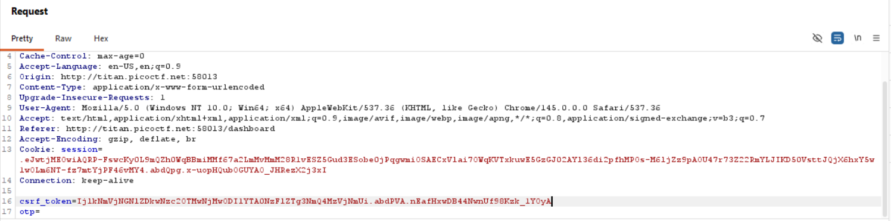
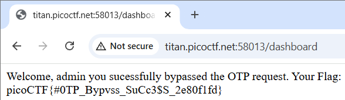

# IntroToBurp

**Platform:** picoCTF

**Category:** Web Exploitation

**Difficulty:** Easy

---

## Challenge Description

> Try here to find the flag

---

## Goal

> To find the flag hidden in the web app

---

## Initial Analysis

The app was a registration site. The first page had a registration form. Entering values in it and then submitting it, took us to a 2-factor authentication page where the user was required to enter their OTP credentials.

| Registration Page                                       | 2fa Authentication Page                                       |
| ------------------------------------------------------- | ------------------------------------------------------------- |
|  |  |

If the OTP credentials were incorrect then the user faced invalid OTP message.



---

## Testing & Exploration

Firstly, I checked the source code of the registration page using Burp Suite. It revealed that the registration form was using a CSRF token.



```
IjlkNmVjNGNlZDkwNzc2OTMwNjMwODI1YTA0NzFlZTg3NmQ4MzVjNmUi.abdPVA.nEafHxwDB44NwnUf98Kzk_1YOyA
```

Cross-site Request Forgery (CSRF) token is a randomly generated value that a server creates. When the user submits the form, the token is sent along with the input values. The server checks if the submit request has the token it had issued earlier.



If yes then the request came from the legitimate form. If not, then it's a forged request from an attacker.

---

## Exploitation

Since the registration page validated the token, I suspected the 2FA might also rely on it.



I decided to test whether injecting the token in the 2FA request header would bypass the authentication.



---

## Getting the Flag

The server accepted the modified request without any proper validation.



Thus, I was able to bypass the 2FA completely and receive the flag.

---

## Flag obtained:

```
picoCTF{#0TP_Bypvss_SuCc3$S_2e80f1fd}
```

---

## Key Takeaways

What I learned from this challenge.

- What CSRF tokens are and their purpose
- Why each authentication step needs to be validated independently

---

## References

[Bright Security CSRF Token Blog](https://brightsec.com/blog/csrf-token/)
