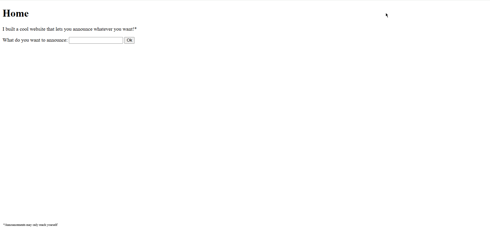
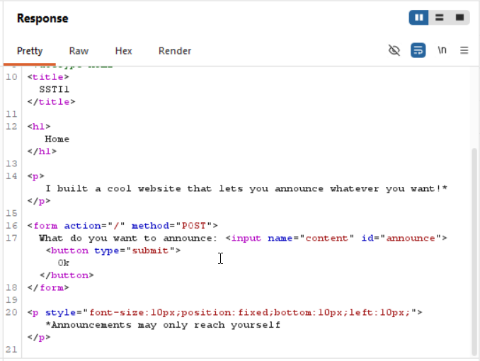
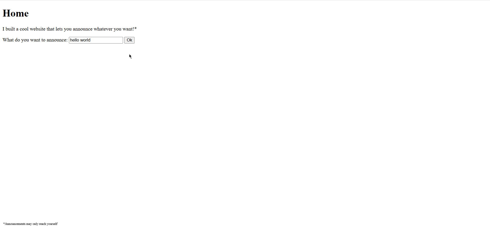
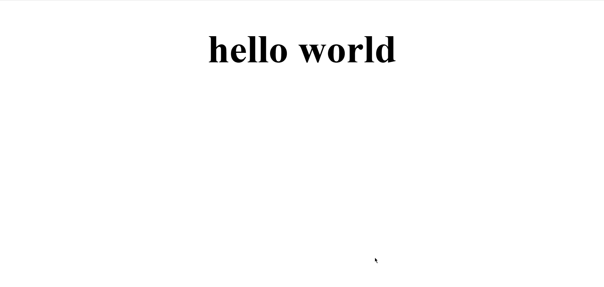
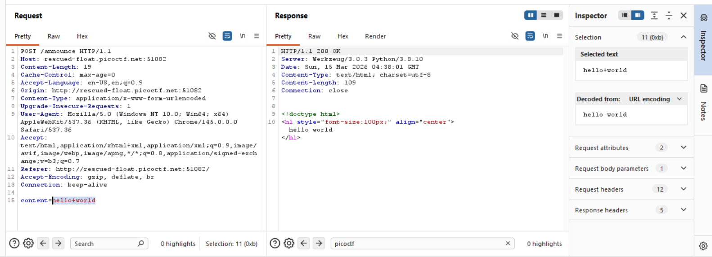
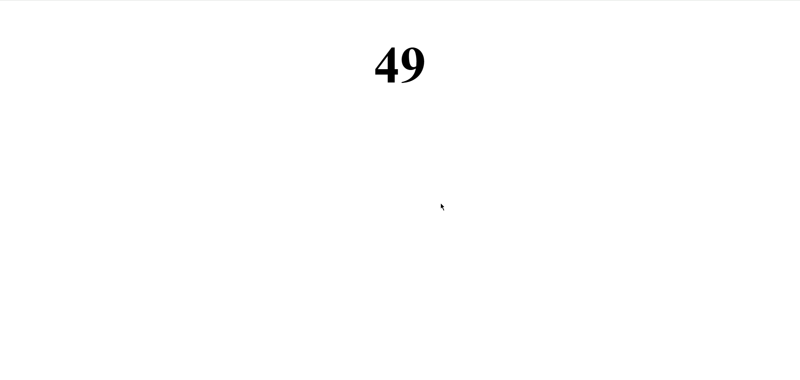
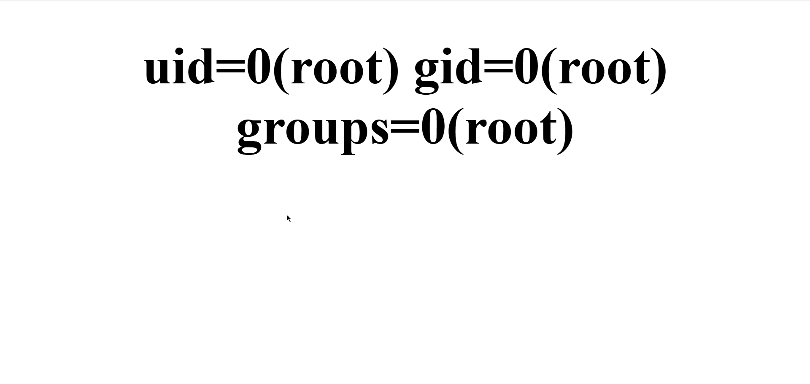
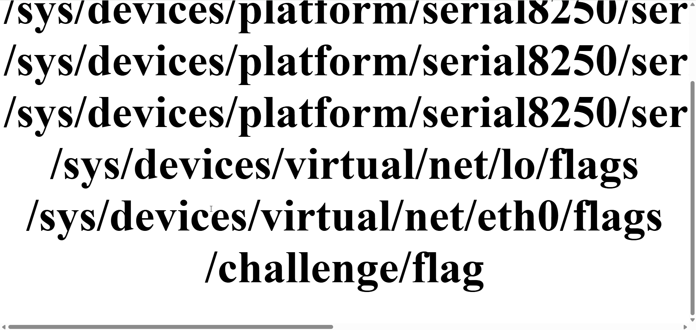
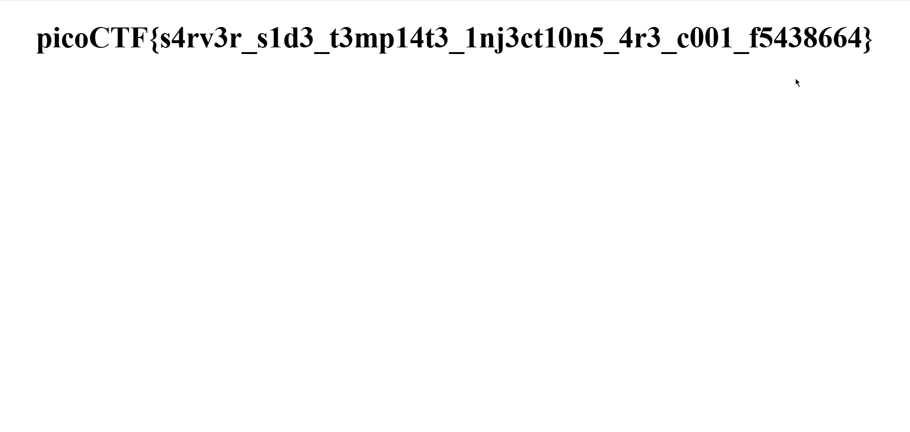

# SSTI1

**Platform:** picoCTF

**Category:** Web Exploitation

**Difficulty:** Easy

---

## Challenge Description

> I made a cool website where you can announce whatever you want! Try it out!
> I heard templating is a cool and modular way to build web apps! Check out my website here!

---

## Goal

> To find the flag hidden in the web app

---

## Initial Analysis

The web app allows user to enter anything they want and announce it on the app.



The app has a form and user input was taken via a text field. Inspecting the page's source code in Burp Suite revealed nothing out of the oridinary.



---

## Testing & Exploration

Initially I tested the web app by entering some normal text like "hello world" to check the output and how the web app works.





Checking the input request in Burp Suite revealed that the input was being encoded using URL encoding.



---

## Exploitation

Since the challenge's name is SSTI, I decided to learn more about it.

SSTI stands for Server-side template injection. It's a vulnerability that occurs when an attacker is able to inject malicious input into a template, which then gets executed on the server side. And since the web app uses templating, it was possible that it contained this vulnerability. In templating developers use a template engine to combine dynamic HTML responses directly into static files.

SSTI arises when web apps directly concatenate user given input into these template engine rather than sanitizing them first.

The most popular template is Jinja2. It's python based. So to check whether Jinja2 is the template engine I decided to input a test payload.

Test payload:

```
{{7*7}}
```

Response received:



Since this test payload worked, it confirmed the existence of SSTI vulnerability in the web app and also that its using Jinja2 as the template engine.

Next step was to craft a payload which would help in finding the flag hidden inside the server. So I searched more about the payloads and found this:

```
{{config.__class__.__init__.__globals__['os'].popen('id').read()}}
```

Let me break down this payload in simple terms:

- `{{}}` evaluates whatever is written inside it
- `config` is a Jinja2 object that exists in the template environment
- `.__class__ ` checks the class of the object
- `.__init__` is a constructor method of every Python class
- `.__globals__` gives the function access all global variables
- `['os'].popen('id)` the function uses os module to interact with os which is then used to run commands in it and read
- `.read()` displays the output

This payload worked and the user ids in the server was displayed.



---

## Getting the Flag

Now to find the flag, the payload was slightly modified.

```
{{config.__class__.__init__.__globals__.__builtins__.__import__('os').popen('find / -iname "flag*"').read()}}
```



The location of the flag was found. Now a final payload to display the flag.

```
{{config.__class__.__init__.__globals__.__builtins__.__import__('os').popen('cat /challenge/flag').read()}}
```



---

## Flag obtained:

```
picoCTF{s4rv3r_s1d3_t3mp14t3_1nj3ct10n5_4r3_c001_f5438664}
```

---

## Key Takeaways

What I learned from this challenge.

- Whats SSTI and Template engines
- How they work
- Why sanitizing user input is important

---

## References

- [Intigriti SSTI](https://www.intigriti.com/researchers/blog/hacking-tools/exploiting-server-side-template-injection-ssti)
- [PortSwigger SSTI](https://portswigger.net/web-security/server-side-template-injection)
